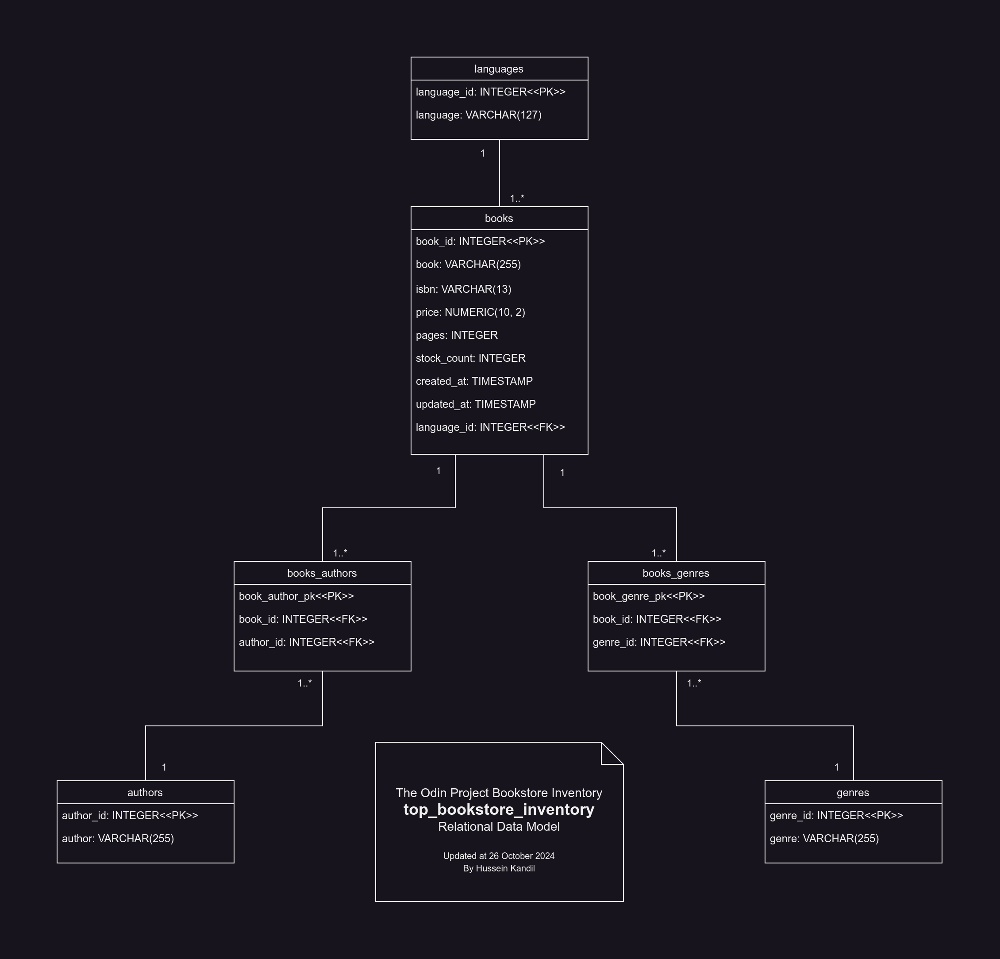

# Odin Inventory App

An inventory management app for an imaginary bookstore developed as part of the
[**Node.js course at The Odin Project**](https://www.theodinproject.com/paths/full-stack-javascript/courses/nodejs).
It allows you to track books and their languages, authors, genres, prices, ...etc.
This app focuses on CRUD operations, form validation,
and database relations between books/languages/authors/genres.

## Relational Data Model

## Core Features

> Note: **This app does not have admin/user accounts**,
> because the curriculum hasn't yet touched upon authentication.

- Book Management:
  - Add, update, delete, and list books.
  - Each book has a title, ISBN, author/s, genre/s, price, language, pages, and stock count.
- Language/Author/Genre Management:
  - Add, update, delete, and list languages/authors/genres
  - A book has a single language and one or more authors/genres.
- Database Relationships (PostgreSQL):
  - One-to-many relation: A language can have many books, while a book has just a single language
  - Many-to-many relations: An author/genre can have many books and a book can have many authors/genres.
- EJS Templates for Views:
  - Display a list of books and book details/forms in a user-friendly way using EJS
  - Reuse components like headers or footers via partials.
- Book details validation with express-validator.
